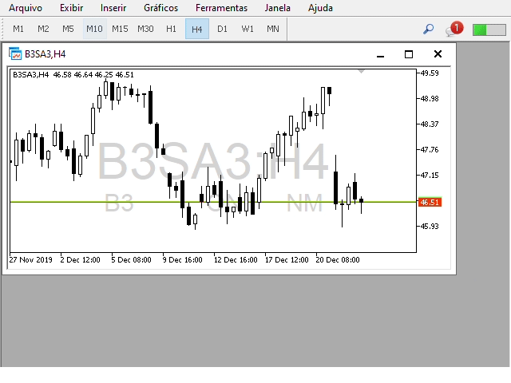
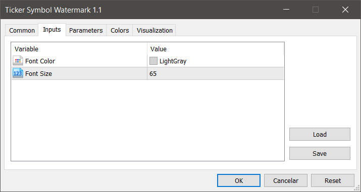

## MetaTrader 5 > Utility > Ticker Symbol Watermark

### Description

**Ticker Symbol Watermark** is a utility tool that draws the ticker symbol and timeframe informations as a watermark in the background of the chart. It may come in handy if you have multiple charts on the screen at the same time.

It just works on any symbol and timeframe.

### Settings

#### Inputs

* **Font Color**: You can choose your favorite from all the available colors or type in a custom RGB color (values from 0 to 255, eg: 100, 128, 255).
* **Font Size**: Automatically adjusted as you resize the chart window. Defaults to 65.

---

### Instructions

1. Copy this project folder to your **MetaEditor** indicator folder.
2. Select the *.mq5* file and click *'Compile'* button on **MetaEditor**.
3. On **MetaTrader**, insert this compiled indicator into the chart you want.

---

#### References

* [MQL5 Documentation](https://www.mql5.com/en/docs)

#### MQL5 Market

* [My MQL5 Published Products](https://www.mql5.com/en/users/leonardo_splinter/seller)
